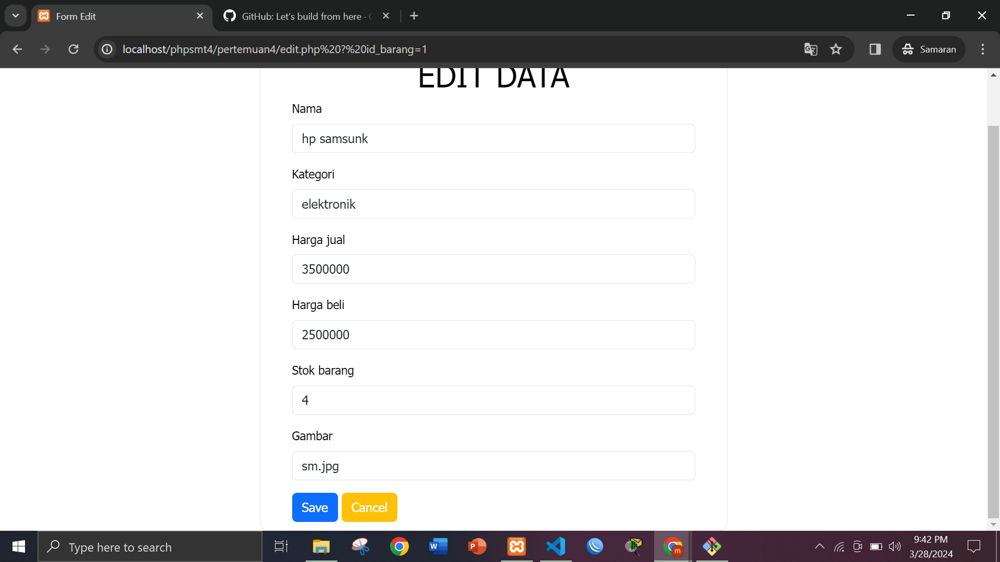
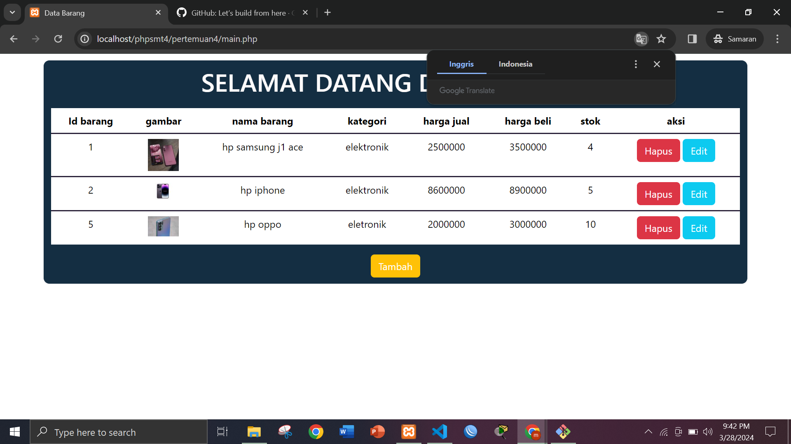
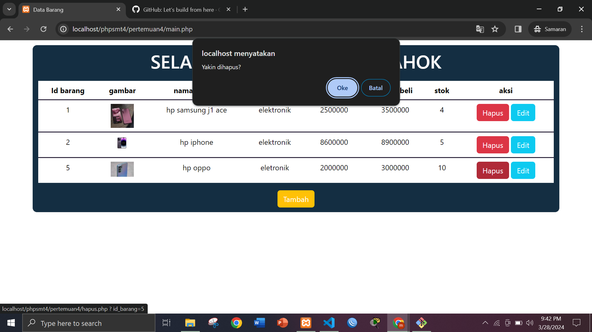

# tugas pertemuan ke 4 dan 5
* layout dari web sederhana

 
* menu edit data dan setelah di edit
  

 
* setelah di edit
  

 

* menu hapus di sini ada alert sebelum di hapus agar memastikan bahwa file yang di hapus itu benar

# di atas adalah contoh crud sederhana edit data dan hapus data# update 
